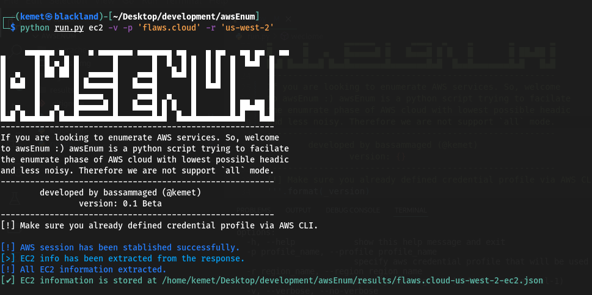

<h1 align="center">awsEnum</h1>
<p align="center">Enumrate AWS services! with no nosies </p>
<p align="center">awsEnum is a python script enumrate AWS services through the provided credential.</p>  

<!-- TABLE OF CONTENTS -->
<h2 id="table-of-contents"> :book: Table of Contents</h2>

<details open="open">
  <summary>Table of Contents</summary>
  <ol>
    <li><a href="#screen">Screenshot</a></li>
    <li><a href="#Disclaimerl">Disclaimer</a></li>
    <li><a href="#Features">Features</a></li>
    <li><a href="#prerequisites">Prerequisites</a></li>
    <li><a href="#how-to-install">How to Install</a></li>
    <li><a href="#results-and-discussion">Results and FQAs</a></li>
    <li><a href="#to-do">To-Do</a></li>
  </ol>
</details>


<h2 id="screen"> :clapper: Screenshot</h2>
<p align="center"> 
  
</p>

```sh
     ▄▄▄▄▄▄ ▄     ▄ ▄▄▄▄▄▄▄ ▄▄▄▄▄▄▄ ▄▄    ▄ ▄▄   ▄▄ ▄▄   ▄▄ 
█      █ █ ▄ █ █       █       █  █  █ █  █ █  █  █▄█  █
█  ▄   █ ██ ██ █  ▄▄▄▄▄█    ▄▄▄█   █▄█ █  █ █  █       █
█ █▄█  █       █ █▄▄▄▄▄█   █▄▄▄█       █  █▄█  █       █
█      █       █▄▄▄▄▄  █    ▄▄▄█  ▄    █       █       █
█  ▄   █   ▄   █▄▄▄▄▄█ █   █▄▄▄█ █ █   █       █ ██▄██ █
█▄█ █▄▄█▄▄█ █▄▄█▄▄▄▄▄▄▄█▄▄▄▄▄▄▄█▄█  █▄▄█▄▄▄▄▄▄▄█▄█   █▄█
--------------------------------------------------------
If you are looking to enumerate AWS services. So, welcome
to awsEnum :) awsEnum is a python script trying to facilate 
the enumrate phase of AWS cloud with lowest possible headic
and less noisy. Therefore we are not support `all` mode.
--------------------------------------------------------
        developed by bassammaged (@kemet)
                version: 0.1 Beta
--------------------------------------------------------
[!] Make sure you already defined credential profile via AWS CLI.

usage: run.py [-h] [-p profile_name] [-r region_name] [-v | --verbose | --no-verbose] [-t TRIES] aws_service_name

positional arguments:
  aws_service_name      Specify the aws service for enumration. Supported services are: ['ec2', 'iam', 's3'] (default: all)

options:
  -h, --help            show this help message and exit
  -p profile_name, --profile profile_name
                        specify aws credential profile that will be used through the enumeration. (default: default)
  -r region_name, --region region_name
                        specify aws region. (default: eu-central-1)
  -v, --verbose, --no-verbose
                        Allows the script to print out the message level start with debug. (default: False)
  -t TRIES, --tries TRIES
                        set maximum tries. (default: 1000)

```

<h2 id="Disclaimer"> :pencil: Disclaimer</h2>

`awsEnum` is in beta version and is supposed to be free of issues but if any issues encountered, please submit the ticket,`awsEnum` is coded and published to be used in partical circumstances:

1. Engaging in penetration testing activity.
2. Carry on Bug hunting activity.
3. AWS cloud security Audit.
4. Any other legal activity that already approved by the owner of the asset.

`awsEnum` is craeted to work under hoodie, which means there's no intention to support `all` mode.
 
<h2 id="Features"> :fuelpump: Features</h2>

- [x] Connect to aws service through `boto3`, on other word! signing request.
- [x] `awsEnum` allows user to set the number of requests [By default: 1000].
- [x] `awsEnum` store result into `json` file.
- [x] Keep AWS credential within `awscli` confugration and just pass profile_name to `awsEnum`.
- [x] Supported service: `ec2`, `iam`, `s3`.  

<h2 id="prerequisites"> :cd: Prerequisites</h2>

1. Python3
2. `pip` package manager
3. `python3 -m pip install requirements.txt`
4. Feel Free to use `awsEnum` via `run.py` script

<h2 id="results-and-discussion"> :paperclip: Results and FQAs</h2>

```json
[
    {
        "AmiLaunchIndex": 0,
        "ImageId": "ami-7c803d1c",
        "InstanceId": "i-05bef8a081f307783",
        "InstanceType": "t2.micro",
        "KeyName": "Default",
        "LaunchTime": "2017-02-12 22:29:24+00:00",
        "Monitoring": {
            "State": "disabled"
        },
        "Placement": {
            "AvailabilityZone": "us-west-2a",
            "GroupName": "",
            "Tenancy": "default"
        },
        "PrivateDnsName": "ip-172-31-41-84.us-west-2.compute.internal",
        "PrivateIpAddress": "172.31.41.84",
        "ProductCodes": [],
        "PublicDnsName": "ec2-35-165-182-7.us-west-2.compute.amazonaws.com",
        "PublicIpAddress": "35.165.182.7",
        "State": {
            "Code": 16,
            "Name": "running"
        },
        "StateTransitionReason": "",
        "SubnetId": "subnet-d962aa90",
        "VpcId": "vpc-1052ce77",
        "Architecture": "x86_64",
        "BlockDeviceMappings": [
            {
                "DeviceName": "/dev/sda1",
                "Ebs": {
                    "AttachTime": "2017-02-12 22:29:25+00:00",
                    "DeleteOnTermination": true,
                    "Status": "attached",
                    "VolumeId": "vol-04f1c039bc13ea950"
                }
            }
        ],
        "ClientToken": "kTOiC1486938563883",
        "EbsOptimized": false,
        "Hypervisor": "xen",
        "IamInstanceProfile": {
            "Arn": "arn:aws:iam::975426262029:instance-profile/flaws",
            "Id": "AIPAIK7LV6U6UXJXQQR3Q"
        },
        "NetworkInterfaces": [
            {
                "Association": {
                    "IpOwnerId": "amazon",
                    "PublicDnsName": "ec2-35-165-182-7.us-west-2.compute.amazonaws.com",
                    "PublicIp": "35.165.182.7"
                },
                "Attachment": {
                    "AttachTime": "2017-02-12 22:29:24+00:00",
                    "AttachmentId": "eni-attach-a4901fc2",
                    "DeleteOnTermination": true,
                    "DeviceIndex": 0,
                    "Status": "attached",
                    "NetworkCardIndex": 0
                },
                "Description": "",
                "Groups": [
                    {
                        "GroupName": "launch-wizard-1",
                        "GroupId": "sg-490f6631"
                    }
                ],
                "Ipv6Addresses": [],
                "MacAddress": "06:b0:7a:92:21:cf",
                "NetworkInterfaceId": "eni-c26ed780",
                "OwnerId": "975426262029",
                "PrivateDnsName": "ip-172-31-41-84.us-west-2.compute.internal",
                "PrivateIpAddress": "172.31.41.84",
                "PrivateIpAddresses": [
                    {
                        "Association": {
                            "IpOwnerId": "amazon",
                            "PublicDnsName": "ec2-35-165-182-7.us-west-2.compute.amazonaws.com",
                            "PublicIp": "35.165.182.7"
                        },
                        "Primary": true,
                        "PrivateDnsName": "ip-172-31-41-84.us-west-2.compute.internal",
                        "PrivateIpAddress": "172.31.41.84"
                    }
                ],
                "SourceDestCheck": true,
                "Status": "in-use",
                "SubnetId": "subnet-d962aa90",
                "VpcId": "vpc-1052ce77",
                "InterfaceType": "interface"
            }
        ],
        "RootDeviceName": "/dev/sda1",
        "RootDeviceType": "ebs",
        "SecurityGroups": [
            {
                "GroupName": "launch-wizard-1",
                "GroupId": "sg-490f6631"
            }
        ],
        "SourceDestCheck": true,
        "VirtualizationType": "hvm",
        "CpuOptions": {
            "CoreCount": 1,
            "ThreadsPerCore": 1
        },
        "CapacityReservationSpecification": {
            "CapacityReservationPreference": "open"
        },
        "HibernationOptions": {
            "Configured": false
        },
        "MetadataOptions": {
            "State": "applied",
            "HttpTokens": "optional",
            "HttpPutResponseHopLimit": 1,
            "HttpEndpoint": "enabled",
            "HttpProtocolIpv6": "disabled",
            "InstanceMetadataTags": "disabled"
        },
        "EnclaveOptions": {
            "Enabled": false
        },
        "PlatformDetails": "Linux/UNIX",
        "UsageOperation": "RunInstances",
        "UsageOperationUpdateTime": "2017-02-12 22:29:24+00:00",
        "PrivateDnsNameOptions": {},
        "MaintenanceOptions": {
            "AutoRecovery": "default"
        }
    }
]
```

<h2 id="to-do"> :paperclip: To-Do</h2>

- [ ] Support `iam`,`s3` services. 
